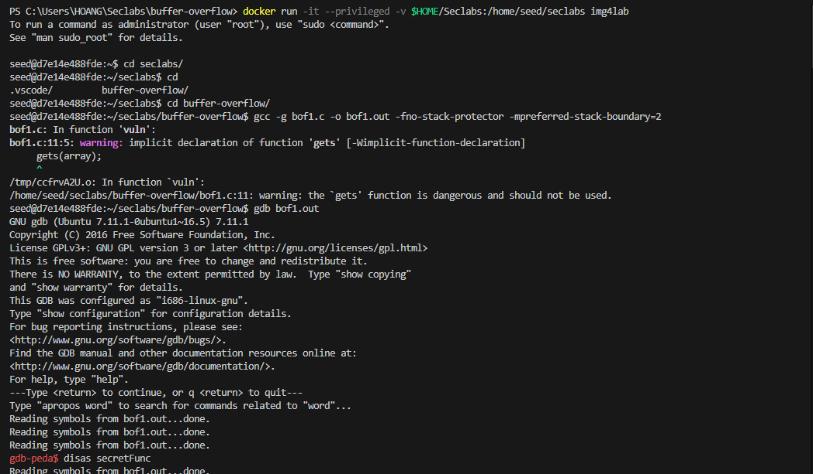

_22110025-LaHuyHoang_

# I. Lab#1 Conduct buffer overflow attack on bof1.c bof2.c bof3.c

## **1. Bof1.c**

- [ ] 
- [ ] 
- [ ] 

### **1.1 Overview**

1. **Buffer Vulnerability**:
   The `vuln` function uses `gets(array)`, which allows an arbitrary amount of input to overflow the `array` buffer (200 bytes). This leads to overwriting adjacent memory locations.
2. **Function Definitions**:

   - `secretFunc`: This function prints a congratulatory message.
   - `vuln`: This is where the overflow occurs.
   - `main`: Checks for command-line arguments and calls `vuln`.

### **1.2 Attack Breakdown**

1. **Compiling the Code**:

   ```bash
   gcc -g bof1.c -o bof1.out -fno-stack-protector -mpreferred-stack-boundary=2
   ```

   - `-g`: Includes debugging information.
   - `-fno-stack-protector`: Disables stack protection mechanisms, making it easier to exploit.
   - `-mpreferred-stack-boundary=2`: Ensures the stack is aligned, which can be helpful for certain attacks.

2. **Disassembling Functions**:
   Using GDB (GNU Debugger), you disassemble `secretFunc` to understand its assembly code and address.
3. **Creating the Exploit**:

   ```bash
   echo $(python -c "print('a'*204 + '\x6b\x84\x04\x08')") | ./bof1.out
   ```

   - `print('a'*204)`: Fills the buffer with 204 'a' characters, which is enough to overflow the buffer and reach the saved return address on the stack.
   - `'\x6b\x84\x04\x08'`: This is the address of `secretFunc`. When the return address is overwritten with this address, the program will jump to `secretFunc` instead of returning normally.

4. **Running the Exploit**:

   - When you run the command:

     ```bash
     echo $(python -c "print('a'*204 + '\x6b\x84\x04\x08')") | ./bof1.out
     ```

     - The input overwrites the return address of `vuln` with the address of `secretFunc`. When `vuln` returns, it will go to `secretFunc`, executing the congratulatory print statement.

### **1.3 Why the Attack Works**

1. **Buffer Overflow**: The lack of bounds checking in `gets` allows you to overflow the buffer.
2. **Overwrite Return Address**: You can overwrite the return address with the address of another function (`secretFunc`), effectively hijacking the program's control flow.
3. **No Stack Protection**: Disabling stack protection (`-fno-stack-protector`) makes the overflow exploitable without defenses that would normally prevent such behavior.

### **1.4 Conclusion**

This example highlights a classic buffer overflow attack, showing how unsafe functions, such as `gets`, can lead to security vulnerabilities. It's essential to use safer alternatives like `fgets` and implement stack protection mechanisms to prevent such attacks in real-world applications.

## **2. Bof2.c**


### **2.1. Overview**

This example demonstrates a classic buffer overflow vulnerability in C programming. The provided code allows for the input of more data than the allocated buffer can hold, which can lead to unintended consequences, such as modifying the value of adjacent variables in memory.

In this specific case, the goal is to manipulate the program's control flow by overwriting the `check` variable with a specific value (`0xdeadbeef`). When this value is reached, the program outputs a success message, indicating that the buffer overflow exploit was successful.

### **2.2. Attack Breakdown**

1. **Compiling the Code**:

   ```bash
   gcc -g bof2.c -o bof2.out -fno-stack-protector -mpreferred-stack-boundary=2
   ```

2. **Running the Attack**:

   ```bash
   echo $(python -c "print('a' * 40 + '\xef\xbe\xad\xde')") | ./bof2.out
   ```

   - `print('a' * 40)`: Fills `buf` with 40 'a' characters, which fills the buffer completely.
   - `'\xef\xbe\xad\xde'`: This is the byte representation of `0xdeadbeef`, which is the value you want to place in the `check` variable. The order is reversed due to little-endian architecture.

3. **Expected Behavior**:

   - When you run the command, the `buf` variable is filled with 'a's, and the memory immediately following `buf` (where `check` is stored) is overwritten with `0xdeadbeef`.
   - The output will show that the buffer contains 'a' characters, and the value of `check` will now equal `0xdeadbeef`.

### **2.3. Why the Attack Works**

1. **Buffer Overflow**:

   - `fgets` is used incorrectly with a buffer larger than it can hold. By writing more than 40 bytes, you overwrite adjacent memory.

2. **Control Over Variable**:

   - By placing `0xdeadbeef` in the right location in memory (just after `buf`), you manipulate the value of `check` to trigger the win condition in the program.

3. **No Stack Protection**:

   - With stack protection disabled (`-fno-stack-protector`), the program is susceptible to this type of attack.

### **2.4. Conclusion**

This example illustrates a classic buffer overflow where improper handling of input can lead to overwriting important data in memory. This is a significant security vulnerability that can be exploited in many real-world applications. Always ensure proper bounds checking and use safer functions to handle user input to prevent such vulnerabilities.

## **3. Bof3.c**

### **3.1. Overview**

This example demonstrates a buffer overflow attack that allows the execution of a specific function in a C program by manipulating the control flow through a function pointer. The program uses a character buffer to read user input and has a vulnerability due to improper handling of the buffer size, allowing for potential exploitation.

### **3.2. Attack Breakdown**

1. **Compiling the Code**:

   ```bash
   gcc -g bof3.c -o bof3.out -fno-stack-protector -mpreferred-stack-boundary=2
   ```

2. **Running the Attack**:

   ```bash
   echo $(python -c "print('a' * 40 + '\x6e\x84\x04\x08')") | ./bof3.out
   ```

   - `print('a' * 40)`: Fills the buffer with 40 'a' characters.
   - `'\x6e\x84\x04\x08'`: This is the address of the `sup` function (from your GDB disassembly output). When this value is written to the memory location of `func`, it redirects the call to `sup` when `func()` is executed.

3. **Expected Behavior**:

   - The output shows `"Congrat!"`, indicating that the `sup` function was successfully executed.

### **3.3 Why the Attack Works**

1. **Buffer Overflow**:

   - By exceeding the allocated buffer size in `fgets`, the input can overwrite adjacent memory, specifically the location of the function pointer `func`.

2. **Control Over Execution Flow**:

   - By overwriting `func` with the address of `sup`, the attacker can control which function is executed when `func()` is called.

3. **Lack of Stack Protections**:

   - With stack protection disabled, there are no safeguards against overwriting return addresses or function pointers.

### **3.4. Conclusion**

This example illustrates how buffer overflows can lead to the manipulation of function pointers in C programs, potentially allowing attackers to execute arbitrary code. It serves as a reminder of the importance of using safe programming practices, such as proper bounds checking and avoiding unsafe functions, to prevent such vulnerabilities in real-world applications.

# II. Lab#2
